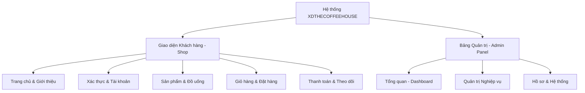

## 🗺️ TỔNG QUAN HỆ THỐNG GIAO DIỆN

---

## 🛒 PHẦN 1: GIAO DIỆN KHÁCH HÀNG (SHOP FRONTEND)

Dưới đây là danh sách các trang giao diện phía khách hàng được xây dựng bằng **Blade Template + Bootstrap 4.5**:

### 1.1 Trang chủ (Home Page)
*   **Đường dẫn URL / Route:** `/` (Tên route: `home`)
*   **File View tương ứng:** `resources/views/shop/home.blade.php`
*   **Thành phần cần chụp:**
    *   **Hero Slider:** Banner lớn có hiệu ứng chuyển động, nút bấm kêu gọi hành động (CTA).
    *   **Thanh thông tin liên hệ (Info Bar):** Địa chỉ, SĐT, giờ mở cửa.
    *   **About Section & Services:** Khối giới thiệu thương hiệu và các dịch vụ nổi bật (Giao hàng nhanh, Cà phê chất lượng...).
    *   **Sản phẩm nổi bật (Featured Products):** Grid các sản phẩm bán chạy có hiển thị badge giảm giá (nếu có) và trạng thái "Còn hàng / Hết hàng".
    *   **Counter Section:** Các con số ấn tượng (100 Chi nhánh, 10.567 Khách hàng...).
*   **Mẹo chụp ảnh:** Chụp bao quát các section để thấy được sự hài hòa trong màu sắc và bố cục chung.

### 1.2 Xác thực & Tài khoản (Authentication)
*   **Đường dẫn URL / Route:**
    *   **Đăng ký:** `/register` (route: `register`)
    *   **Đăng nhập:** `/login` (route: `login`)
    *   **Quên mật khẩu:** `/forgot-password` (route: `password.request`)
    *   **Đặt lại mật khẩu:** `/reset-password/{token}` (route: `password.reset`)
*   **File View tương ứng:**
    *   `resources/views/auth/register.blade.php`
    *   `resources/views/auth/login.blade.php`
    *   `resources/views/auth/forgot-password.blade.php`
    *   `resources/views/auth/reset-password.blade.php`
*   **Thành phần cần chụp:**
    *   Form nhập liệu được bo góc hiện đại, các thông báo lỗi validate bằng tiếng Việt (nếu nhập sai).
    *   Nút đăng nhập nhanh bằng **Google OAuth**.
*   **Mẹo chụp ảnh:** Chụp thêm cả màn hình hiển thị thông báo lỗi validate (ví dụ: mật khẩu không khớp) để chứng minh logic hệ thống hoàn thiện.

### 1.3 Trang Danh sách sản phẩm (Product Catalog / Menu)
*   **Đường dẫn URL / Route:** `/san-pham` (route: `products.index`) hoặc `/danh-muc/{slug}` (route: `categories.show`)
*   **File View tương ứng:** `resources/views/shop/products/index.blade.php`
*   **Thành phần cần chụp:**
    *   **Thanh tìm kiếm & lọc:** Ô nhập tìm kiếm sản phẩm, bộ lọc theo danh mục, dropdown sắp xếp (Mới nhất, Giá tăng dần, Giá giảm dần...).
    *   **Grid sản phẩm:** Hiển thị 12 sản phẩm trên một trang, có hiển thị giá gốc và giá khuyến mãi.
    *   **Phần phân trang (Pagination):** Bố cục điều hướng trang ở dưới cùng.

### 1.4 Trang Chi tiết sản phẩm (Product Details)
*   **Đường dẫn URL / Route:** `/san-pham/{slug}` (route: `products.show`)
*   **File View tương ứng:** `resources/views/shop/products/show.blade.php`
*   **Thành phần cần chụp:**
    *   **Hình ảnh sản phẩm:** Ảnh chính lớn và thư viện ảnh phụ nhỏ bên dưới.
    *   **Tùy chọn kích cỡ (Sizes):** Nút chọn size M, L, XL kèm giá tiền thay đổi động.
    *   **Tùy chọn gia vị/topping (Modifiers):** Mức đường, mức đá, loại sữa, và topping thêm vào kèm phụ phí.
    *   **Phần đánh giá sản phẩm:** Rating sao trung bình và danh sách các đánh giá đã duyệt từ khách hàng thực tế.
*   **Mẹo chụp ảnh:** Hãy chọn sản phẩm thuộc nhóm đồ uống có đầy đủ các modifier (ví dụ: *Trà Sữa Trân Châu* hoặc *Caramel Macchiato*) để bức ảnh trông đầy đặn tính năng.

### 1.5 Trang Giỏ hàng (Shopping Cart)
*   **Đường dẫn URL / Route:** `/gio-hang` (route: `cart.index`)
*   **File View tương ứng:** `resources/views/shop/cart/index.blade.php`
*   **Thành phần cần chụp:**
    *   Bảng sản phẩm đã chọn: Hình ảnh, Tên sản phẩm đi kèm chi tiết tùy chọn (size, topping...), số lượng có nút tăng giảm (+/-), đơn giá và thành tiền.
    *   **Khối tổng giá trị đơn hàng:** Tạm tính và nút "Tiến hành đặt hàng".

### 1.6 Trang Đặt hàng / Xác nhận thông tin (Checkout)
*   **Đường dẫn URL / Route:** `/dat-hang/xac-nhan` (route: `orders.checkout`)
*   **File View tương ứng:** `resources/views/shop/orders/checkout.blade.php`
*   **Thành phần cần chụp:**
    *   **Form thông tin giao hàng:** Tên người nhận, SĐT, ghi chú, và dropdown liên kết 3 cấp **Tỉnh/Thành phố -> Quận/Huyện -> Phường/Xã**.
    *   **Phí ship:** Được tính tự động dựa trên địa chỉ (TP.HCM là 15k, tỉnh thành khác 25k).
    *   **Khối tóm tắt đơn hàng:** Danh sách rút gọn và tổng số tiền cuối cùng cần thanh toán.

### 1.7 Trang Chọn phương thức thanh toán & Thực hiện thanh toán (Payment)
*   **Đường dẫn URL / Route:**
    *   **Trang lựa chọn:** `/thanh-toan/{order}` (route: `payment.index`)
    *   **Trang quét mã VietQR:** `/thanh-toan/vietqr/{order}` (route: `payment.vietqr`)
*   **File View tương ứng:**
    *   `resources/views/shop/payment/index.blade.php`
    *   `resources/views/shop/payment/vietqr.blade.php`
*   **Thành phần cần chụp:**
    *   **Trang lựa chọn:** 4 phương thức thanh toán trực quan (COD, VietQR, PayPal, MoMo).
    *   **Trang VietQR:** Mã QR Code động chứa số tiền và nội dung chuyển khoản tự động, logo ngân hàng MB, và hướng dẫn quét.
*   **Mẹo chụp ảnh:** Chụp giao diện VietQR kèm theo màn hình điện thoại quét QR thành công (nếu có thể) sẽ tạo điểm nhấn rất lớn cho phần tích hợp thanh toán.

### 1.8 Trang Thông báo thanh toán thành công (Payment Success)
*   **Đường dẫn URL / Route:** `/thanh-toan/thanh-cong/{order}` (route: `payment.success`)
*   **File View tương ứng:** `resources/views/shop/payment/success.blade.php`
*   **Thành phần cần chụp:**
    *   Thông điệp chúc mừng thành công với icon tích xanh lá cây, mã đơn hàng (XDxxxxx), tổng thanh toán và phương thức thanh toán.
    *   Nút bấm "Xem lịch sử đơn hàng" hoặc "Tiếp tục mua sắm".

### 1.9 Trang Lịch sử đơn hàng (Order History)
*   **Đường dẫn URL / Route:** `/dat-hang/lich-su` (route: `orders.history`)
*   **File View tương ứng:** `resources/views/shop/orders/history.blade.php`
*   **Thành phần cần chụp:**
    *   Danh sách các đơn hàng đã đặt của tài khoản: Mã đơn, ngày đặt, tổng tiền, trạng thái đơn hàng (Màu sắc phân biệt: Xám - Chờ xử lý, Xanh dương - Đang giao, Xanh lá - Hoàn thành, Đỏ - Đã hủy).

### 1.10 Trang Chi tiết đơn hàng & Theo dõi trạng thái (Order Detail & Tracking)
*   **Đường dẫn URL / Route:** `/dat-hang/{order}` (route: `orders.show`)
*   **File View tương ứng:** `resources/views/shop/orders/show.blade.php`
*   **Thành phần cần chụp:**
    *   **Stepper trạng thái đơn hàng:** Progress bar hiển thị quá trình (Chờ xử lý ➔ Đang giao ➔ Hoàn thành).
    *   **Stepper trạng thái pha chế (Drink Status):** Timeline realtime (Đã nhận đơn ➔ Đang pha chế ➔ Đã hoàn thành pha chế).
    *   Thông tin chi tiết người nhận, địa chỉ giao hàng và bảng danh sách món nước đã đặt.
*   **Mẹo chụp ảnh:** Nên chụp trang này ở 2 trạng thái: Một đơn hàng đang ở trạng thái pha chế và một đơn hàng đã hoàn thành để thể hiện sự thay đổi của timeline.

### 1.11 Trang Hồ sơ cá nhân & Chỉnh sửa thông tin (Customer Profile)
*   **Đường dẫn URL / Route:**
    *   **Xem thông tin:** `/ho-so` (route: `profile.show`)
    *   **Chỉnh sửa:** `/ho-so/chinh-sua` (route: `profile.edit`)
*   **File View tương ứng:**
    *   `resources/views/shop/profile/show.blade.php`
    *   `resources/views/shop/profile/edit.blade.php`
*   **Thành phần cần chụp:**
    *   Avatar của khách hàng, các thông số thống kê (Tổng đơn hàng đã đặt).
    *   Form cập nhật thông tin cá nhân và Form đổi mật khẩu.

---

## 💼 PHẦN 2: GIAO DIỆN QUẢN TRỊ (ADMIN PANEL)

Bảng quản trị được phân quyền chặt chẽ theo vai trò (**Admin, Cashier, Staff, Warehouse**) và được thiết kế theo tone màu **Coffee Premium Theme (Nâu đen & Vàng đồng)** sử dụng **TailwindCSS**:

### 2.1 Trang Đăng nhập Admin (Admin Login)
*   **Đường dẫn URL / Route:** `/admin/login` (route: `admin.login`)
*   **File View tương ứng:** `resources/views/admin/auth/login.blade.php`
*   **Thành phần cần chụp:** Giao diện đăng nhập tách biệt tối giản, nền tối sang trọng dành riêng cho đội ngũ vận hành hệ thống.

### 2.2 Trang Dashboard (Bảng điều khiển tổng quan)
*   **Đường dẫn URL / Route:** `/admin` (route: `admin.dashboard`)
*   **File View tương ứng:** `resources/views/admin/dashboard.blade.php`
*   **Thành phần cần chụp:**
    *   **KPI Cards:** Các ô số liệu thống kê (Tổng đơn hàng, Đơn chờ xử lý, Doanh thu thực tế, Khách hàng, Sản phẩm...).
    *   **Biểu đồ 7 ngày (Chart.js):** Doanh thu và số lượng đơn hàng theo ngày trực quan.
    *   **Đơn hàng mới nhất:** Bảng danh sách 10 giao dịch gần đây.
    *   **Đơn hàng đang pha chế:** Danh sách các đơn cần pha chế kèm nút cập nhật nhanh cho nhân viên pha chế.

### 2.3 Trang Hồ sơ Admin (Admin Profile)
*   **Đường dẫn URL / Route:** `/admin/profile` (route: `admin.profile.edit`)
*   **File View tương ứng:** `resources/views/admin/profile/edit.blade.php`
*   **Thành phần cần chụp:** Form cập nhật thông tin cá nhân của nhân viên, form đổi mật khẩu và khu vực upload avatar.

### 2.4 Quản lý Sản phẩm (Product Management)
*   **Đường dẫn URL / Route:**
    *   **Danh sách:** `/admin/products` (route: `admin.products.index`)
    *   **Thêm mới:** `/admin/products/create` (route: `admin.products.create`)
    *   **Chỉnh sửa:** `/admin/products/{id}/edit` (route: `admin.products.edit`)
*   **File View tương ứng:**
    *   `resources/views/admin/products/index.blade.php`
    *   `resources/views/admin/products/create.blade.php`
    *   `resources/views/admin/products/edit.blade.php`
*   **Thành phần cần chụp:**
    *   **Danh sách sản phẩm:** Bảng dữ liệu có thumbnail, phân loại theo trạng thái (Đang bán, Đã xóa mềm...), tồn kho, giá bán. Nút "Khôi phục" đối với sản phẩm đã xóa.
    *   **Form thêm/sửa:** Khu vực nhập thông tin cơ bản, chọn nhiều size (M, L, XL) kèm giá riêng biệt, các checkbox cấu hình đồ uống (đường, đá, sữa, topping).
*   **Mẹo chụp ảnh:** Với nhân viên kho (`warehouse`), chỉ chụp phần chỉnh sửa tồn kho (`stock`), chứng minh phân quyền chỉ được sửa tồn kho.

### 2.5 Quản lý Danh mục (Category Management)
*   **Đường dẫn URL / Route:**
    *   **Danh sách:** `/admin/categories` (route: `admin.categories.index`)
    *   **Thêm mới:** `/admin/categories/create` (route: `admin.categories.create`)
    *   **Chỉnh sửa:** `/admin/categories/{id}/edit` (route: `admin.categories.edit`)
*   **File View tương ứng:**
    *   `resources/views/admin/categories/index.blade.php`
    *   `resources/views/admin/categories/create.blade.php`
    *   `resources/views/admin/categories/edit.blade.php`
*   **Thành phần cần chụp:** Bảng danh mục sản phẩm kèm số lượng sản phẩm liên kết (`withCount`), thứ tự sắp xếp hiển thị.

### 2.6 Quản lý Đơn hàng (Order Management)
*   **Đường dẫn URL / Route:**
    *   **Danh sách:** `/admin/orders` (route: `admin.orders.index`)
    *   **Chi tiết:** `/admin/orders/{id}` (route: `admin.orders.show`)
*   **File View tương ứng:**
    *   `resources/views/admin/orders/index.blade.php`
    *   `resources/views/admin/orders/show.blade.php`
*   **Thành phần cần chụp:**
    *   **Các Tab trạng thái nhanh:** Tất cả | Chờ xử lý | Đang giao | Hoàn thành | Đã hủy.
    *   **Chi tiết đơn hàng:** Form cập nhật trạng thái đơn hàng (Admin/Cashier), cập nhật trạng thái thanh toán, cập nhật trạng thái pha chế (Admin/Staff), và thông tin hóa đơn chi tiết.

### 2.7 Quản lý Khách hàng & Nhân viên (Users Management)
*   **Đường dẫn URL / Route:**
    *   **Danh sách khách hàng:** `/admin/customers` (route: `admin.customers.index`)
    *   **Chi tiết khách hàng:** `/admin/customers/{id}` (route: `admin.customers.show`)
    *   **Danh sách nhân viên:** `/admin/employees` (route: `admin.employees.index`)
    *   **Thêm nhân viên:** `/admin/employees/create` (route: `admin.employees.create`)
*   **File View tương ứng:**
    *   `resources/views/admin/customers/index.blade.php`
    *   `resources/views/admin/customers/show.blade.php`
    *   `resources/views/admin/employees/index.blade.php`
    *   `resources/views/admin/employees/create.blade.php`
*   **Thành phần cần chụp:** Bảng hiển thị thông tin tài khoản kèm badge phân quyền vai trò (Admin, Cashier, Staff, Warehouse) màu sắc khác nhau.

### 2.8 Báo cáo Thống kê doanh thu (Statistics)
*   **Đường dẫn URL / Route:** `/admin/statistics` (route: `admin.statistics.index`)
*   **File View tương ứng:** `resources/views/admin/statistics/index.blade.php`
*   **Thành phần cần chụp:**
    *   **Bộ lọc kỳ hạn:** Chọn mốc thời gian 7 ngày, 30 ngày, 90 ngày, 365 ngày.
    *   **Biểu đồ đường/cột:** Doanh thu thực tế.
    *   **Top 10 sản phẩm bán chạy:** Bảng xếp hạng sản phẩm kèm số lượng và doanh thu mang lại.
    *   **Doanh thu theo danh mục & Phương thức thanh toán:** Biểu đồ cơ cấu doanh thu.
    *   **Nút "Xuất Excel" (Export):** Xuất báo cáo giao dịch ra file `.xlsx`.
*   **Mẹo chụp ảnh:** Chụp kèm hình ảnh file Excel sau khi tải về để chứng minh hệ thống xuất báo cáo hoạt động tốt.

### 2.9 Quản lý Mẫu Email (Email Templates Management)
*   **Đường dẫn URL / Route:**
    *   **Danh sách mẫu:** `/admin/email-templates` (route: `admin.email-templates.index`)
    *   **Chỉnh sửa:** `/admin/email-templates/{id}/edit` (route: `admin.email-templates.edit`)
    *   **Xem trước:** `/admin/email-templates/{id}/preview` (route: `admin.email-templates.preview`)
*   **File View tương ứng:**
    *   `resources/views/admin/email-templates/index.blade.php`
    *   `resources/views/admin/email-templates/edit.blade.php`
*   **Thành phần cần chụp:**
    *   **Danh sách:** Các mẫu email (Đăng ký thành công, Cập nhật đơn hàng, Cập nhật pha chế...).
    *   **Form sửa:** Trình soạn thảo HTML, khung hướng dẫn điền các Placeholder như `{customer_name}`, `{order_code}`.
    *   **Trang Preview:** Bản render trực quan mẫu email HTML trên trình duyệt.

---

## 🤖 PHẦN 3: CÁC THÀNH PHẦN TƯƠNG TÁC & TIỆN ÍCH ĐẶC BIỆT

Đây là các thành phần bổ trợ chạy ngầm hoặc dạng widget bật lên (popup/modal) trên giao diện rất quan trọng cho đồ án:

### 3.1 CaféAI Chatbot Widget (Trợ lý ảo thông minh)
*   **Vị trí hiển thị:** Widget nổi ở góc dưới bên phải tất cả các trang phía khách hàng.
*   **Thành phần cần chụp:**
    *   Màn hình chatbox khi mở ra, hiển thị đoạn chào mừng cá nhân hóa.
    *   Các tin nhắn hội thoại tư vấn đồ uống theo thời tiết (ví dụ: "Hôm nay trời nóng 32 độ, khuyên bạn nên dùng Trà Đào Cam Sả đá").
    *   Sản phẩm được gợi ý hiển thị dạng thẻ card kèm nút "Thêm nhanh vào giỏ hàng" trực tiếp từ khung chat.
    *   Đoạn tra cứu đơn hàng theo mã tracking nhập vào ô chat.
*   **Mẹo chụp ảnh:** Chụp một cuộc hội thoại đầy đủ tính năng (hỏi thời tiết -> chatbot gợi ý đồ uống -> bấm nút thêm vào giỏ ngay trên khung chat).

### 3.2 Hệ thống Thông báo In-App (Notifications Dropdown)
*   **Vị trí hiển thị:** Bell icon trên thanh Header của khách hàng.
*   **Thành phần cần chụp:** Dropdown hiển thị danh sách các thông báo mới nhất như *"Đơn hàng #XD00001 của bạn đã hoàn thành pha chế"* kèm dấu chấm màu đỏ báo hiệu chưa đọc.

### 3.3 Hộp thoại SweetAlert2 (Popup xác nhận)
*   **Thành phần cần chụp:**
    *   Popup xác nhận khi bấm Xóa sản phẩm khỏi giỏ hàng.
    *   Popup thông báo đặt hàng thành công.
    *   Popup xác nhận Hủy đơn hàng kèm ô nhập lý do hủy.

---

## 📧 PHẦN 4: HỆ THỐNG EMAIL TỰ ĐỘNG (HTML EMAILS)

Chụp ảnh các email thực tế gửi vào hộp thư của khách hàng (có thể kiểm tra qua Mailtrap, Mailpit hoặc Gmail thực tế):

1.  **Email Đăng ký thành công (`register_success`):** Thư chào mừng thành viên mới.
2.  **Email Xác nhận đơn hàng (`order_placed`):** Chứa hóa đơn điện tử dạng bảng HTML cực kỳ đẹp mắt với thông tin chi tiết món nước, size, giá và tổng tiền.
3.  **Email Cập nhật trạng thái pha chế (`drink_status_updated`):** Thông báo khi đồ uống bắt đầu được pha hoặc pha xong.
4.  **Email Cập nhật trạng thái đơn hàng (`order_status_updated`):** Thông báo đơn hàng đang được đi giao hoặc đã hoàn thành.

---

## 📋 GỢI Ý CẤU TRÚC HÌNH ẢNH TRONG BÁO CÁO ĐỒ ÁN (THESIS STRUCTURE)

Bạn có thể đưa hình ảnh chụp được vào báo cáo theo cấu trúc chương như sau:

*   **Chương 3: Thiết kế và Hiện thực hệ thống**
    *   *3.3. Hiện thực giao diện phía Khách hàng*
        *   Hình 3.1: Giao diện Trang chủ XDTHECOFFEEHOUSE
        *   Hình 3.2: Giao diện Danh sách sản phẩm và Bộ lọc tìm kiếm
        *   Hình 3.3: Giao diện Trang Chi tiết sản phẩm với các tùy chọn modifiers
        *   Hình 3.4: Giao diện Giỏ hàng và Trang Xác nhận đặt hàng
        *   Hình 3.5: Giao diện Tích hợp cổng thanh toán trực tuyến VietQR
        *   Hình 3.6: Giao diện Theo dõi trạng thái đơn hàng và tiến trình pha chế đồ uống
        *   Hình 3.7: Trợ lý ảo CaféAI tư vấn sản phẩm và tra cứu đơn hàng bằng AI
    *   *3.4. Hiện thực giao diện Quản trị (Admin)*
        *   Hình 3.8: Bảng điều khiển tổng quan Dashboard với biểu đồ doanh thu Chart.js
        *   Hình 3.9: Giao diện Quản lý danh sách và Form thêm mới sản phẩm
        *   Hình 3.10: Giao diện Quản lý và xử lý trạng thái Đơn hàng
        *   Hình 3.11: Giao diện Quản lý phân quyền Nhân viên và Khách hàng
        *   Hình 3.12: Giao diện Quản lý và biên tập nội dung Email Template động
        *   Hình 3.13: Giao diện Báo cáo thống kê và tính năng xuất file Excel
        *   Hình 3.14: Hệ thống gửi Email thông báo tự động đến khách hàng
